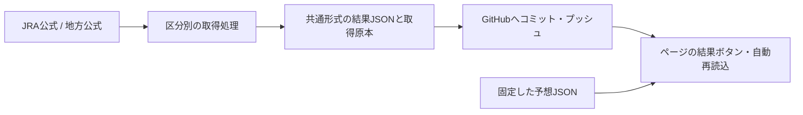

# JRA・地方競馬 共通仕様 v1.0

## 2026-10-09 結果更新の停止対策

- 18:51 JSTのGitHub pullが「Empty reply from server」で失敗し、旧local workerが終了。18:49以降の公開結果が止まった。ボタンの保存ファイル取得成功だけでは、収集の継続や最新の公式着順表示を確認したことにならない。
- 修正：Git操作を45秒で打切り、pull/pushを再試行。取得サイクルの例外でも5〜60秒後に復帰し、ローカルに残った未送信コミットは差分がなくても再送する。1会場の失敗で他会場を停止しない。対象日・会場・HTMLの範囲だけを保存し、既存の未解決merge/rebaseや別作業のステージを同梱しない。
- local workerは親プロセスが子の異常終了を監視し、対象日・終了時刻内で再起動する。同じクローンの二重起動をファイルロックで防ぐ。`--state-file` に稼働・再試行・公開・全対象確定の状態を記録する。PCの停止・スリープ・ネット切断中には配信できない。
- 画面は表示復帰・フォーカス復帰・pageshow時も再取得。画面確認時刻を表示し、発走済み未確定が残る場合は更新間隔の3倍（通常6分）で警告する。全対象確定・未来のレースのみの場合は経過時間だけで警告しない。
- 確認必須：公式の着順・払戻、固定予想ハッシュ・全頭の対応、コミットのリモート反映、公開HTMLと結果JSON、実際のボタンと印・着順の表示。通信失敗・再送・古いデータ・誤データ・スマホ復帰の回帰テストを `tests/test_watch_nar_results.py` と `tests/test_day_report.js` に保存。


更新：2026-10-08 JST。ユーザーと合意した画面構成・保存方法・結果表示・買い方補助の仕様。

正本はこのリポジトリの本書。両チャットは作業開始時に本書と [データ契約](data-contract.md) を読む。予想・検証の方針は共有フォルダの `docs/競馬予想_共通方針.md` を併読する。

**採用する構成：JRA・地方は別ページ。各開催日につき1ページとし、その中で競馬場をタブ切替。** 表示と操作を共通化し、出馬表・結果の取得処理と予想モデルは区分ごとに持つ。

スマホ向けの概要：[共通仕様の案内](https://zunchilab.github.io/KBA/docs/common-spec.html)。実装用の詳細は本書を参照。

## 1. 現在の実装状況

本書の作成だけで未接続の機能が動き出すわけではない。2026-10-08の実装範囲を以下に記録する。日別の公開・稼働は対象ファイルとActionsで別途確認する。

| 項目 | JRA | 地方競馬 | 共通化する形 |
|---|---|---|---|
| 全頭評価・印・根拠・買い目 | 10/4の固定HTML・JSONあり | 10/7の園田・大井にあり | 同じ項目・配置。指数の意味は各モデルで説明 |
| 競馬場の切替 | 10/4の全24Rページに会場フィルターあり | 10/8新規版から開催日ページの会場タブ | JRAの次回作成でも同じ構成を採用 |
| 公式結果の取得 | 10/4の取得処理・確定結果・反省あり | 公式取得処理・結果JSONあり | 取得処理の出力を共通の結果形式に変換 |
| 結果ボタン・印と着順の常時表示 | 公開ページへ未接続 | 旧会場別版と10/8会場タブ版に実装 | 初期表示にも結果を保存 |
| 結果の継続取得・公開 | 未接続 | 会場タブの予想を会場別取得へ投影。全対象確定で停止 | 開催日と対象・実行窓を日別に登録 |
| GitHub保存 | 共通公開スクリプトで受け入れる形式を追加 | 従来の公開手順あり | `scripts/publish_prediction.ps1` を両区分から使用 |
| 点数・予算・端末の購入記録 | 共通補助を利用可能 | 共通補助を利用可能 | `tools/bet-planner.html`。区分・券種・金額を保存 |
| 実購入の結果自動照合 | 未実装 | 未実装 | 購入JSONを読み込む別機能として実装する |
| 共通データ形式 | 旧形式あり | 10/8新規予想はkba.forecast/1、結果は旧形式 | [変換対応表](data-contract.md)に従い新規出力を揃える。旧原本は維持 |

JRAの継続取得や、新しい競馬場タブへの既存ページの移行は実施していない。地方の新規開催日ページで共通構成を導入する。過去の予想原本とURLは維持する。

## 2. 画面とタブ

### 開催日の入口

- 一覧から「2026-10-XX JRA」「2026-10-XX 地方競馬」を開く。別の日は別ページにする。
- 推奨名は `report_YYYYMMDD_jra_predictions_vN.html` と `report_YYYYMMDD_nar_predictions_vN.html`。対応JSONは同名。
- ページ上部は、開催日・区分、予想版と固定時刻、競馬場タブ、レース番号、結果更新状況、1日の予算の順。
- JRAでは「東京｜京都」など、地方では「園田｜大井」など、そのページで予想した競馬場だけを表示する。
- 競馬場とレースをURLへ保存する。例：`?venue=ooi#nar-2026-10-07-ooi-r11`。共有・再読込・戻る操作で同じ位置へ戻れるようにする。
- タブの選択を変えても、各場の検索・並べ替え・読んでいたレースを保持する。結果更新でタブやスクロール位置を初期化しない。

### スマホでの操作

- タブとレース番号は押しやすい大きさにし、横に収まらない場合はその列だけ横スクロールできるようにする。
- 競馬場タブには選択状態と適切なARIA属性を付け、矢印キー・Home・Endにも対応する。
- 1ページへ各会場の内容を組み込む。入れ子のスクロールが発生するiframeは使わない。
- DOMのIDは競馬場を含む `race_uid` にする。各場の `r1` などが重複しないようにする。
- JavaScriptを使えない場合は全競馬場を見出しとリンクで読める。公開済みの印・着順も読めるようにする。
- HTMLは1ページでも、データと取得原本は区分・日付・競馬場で分けてよい。1場の取得失敗が他場の表示を消さない構成にする。

### 各レースの表示順

1. 発走時刻・距離・芝／ダート・馬場状態・出走状況・予想固定時刻。
2. 「買う候補／少額候補／見送り」と理由、主展開・別展開、不確実な点。
3. **本線の買い目**：全組合せ、点数、1点金額、合計、価格下限と確認時刻、購入を止める条件。
4. 三連単などの別案：本線との重複、追加費用、1・2・3着に置く馬と理由。「本線＋別案を全部買う」表示にしない。
5. **印と着順**：馬番・馬名・印・事前順位・現在の着順を同じ一覧へ。折り畳まず、結果更新が失敗しても残す。
6. 全頭の評価カード：スコアの意味、根拠、懸念、欠損、着順。総合順／馬番順を切替可能にする。
7. 公式着順・払戻、掲載案の仮想照合、購入記録がある場合の実購入照合、出典。

JRAの調教・芝の条件・WIN5、地方の小回り・転入・主催者ごとの級などは追加項目。空欄を埋めるために未確認情報を作らない。スコアの数値をJRAと地方で直接比較しない。

## 3. 結果の取得と表示

### 処理の流れ



- ボタンの文言は「結果を更新」。公開された結果JSONを読み直す操作であり、スマホから公式ページを直接スクレイピングする操作ではない。
- 取得側が公式を確認してGitHubへ保存する。公式掲載・収集・push・配信の各遅延があるため、時刻を明示する。
- **予想固定時刻、公式確認時刻、公開時刻、画面読込時刻**を区別する。取得失敗時に公式確認時刻を現在時刻へ書き換えない。
- 対象の開催日・競馬場・レース番号・出走馬を照合する。別日や別会場の結果を採用しない。
- 取得URLは公式の出馬表・結果一覧から確認する。JRAのCNAMEのチェック部分などを未確認の規則で作らない。
- 予想JSONの版とハッシュを照合し、違う版へ結果や買い目を結び付けない。

### 情報源

1. 公式の確定着順・払戻を最終判定に使用する。
2. 公式に接続できない場合は、netkeibaなどの取得可能な結果を速報として使える。その場合は出典と時刻を明示し、公式未照合と表示する。
3. 非公式結果で既存の公式確定結果を上書きしない。食い違ったら競合を記録して確定集計を保留し、公式へ再照合する。

**非公式の取得処理は現在未実装。** 本書で許容することと、利用できる取得処理があることを区別する。会員限定データやアクセス制限を回避する実装は行わない。

### 更新の頻度と停止

- 対象日・対象レース・初回取得時刻・停止時刻を登録する。発走前のレースを無条件に繰り返し取得しない。
- 開催中の目安は、収集側が約2分、表示中のブラウザーが約1分。GitHub Actionsのscheduleの起動時刻を保証された取得間隔として扱わない。
- 全対象が公式確定したら収集・自動再読込を止める。取得失敗や未確定が残ったら、停止時刻に未完了の対象を記録する。
- 未確定のデータが想定更新間隔の3倍以上古ければ更新停止の可能性を表示する。全対象確定済みは「確定済み」と表示し、経過時間だけで古い結果と警告しない。
- 手動更新ではmainの最新コミットを確認し、そのコミットのJSONを読む。確認できないときは保存済みへ戻し、最新確認ができなかったことを知らせる。
- 公式訂正の再照合は停止後でも手動でできるようにする。訂正時刻・変更点を追記し、事前予想は変えない。
- ブラウザーへ秘密鍵・アクセストークンを置かない。

### 状態と判定

| 状態 | 表示・扱い |
|---|---|
| `not_started` | 発走前。着順を作らない |
| `pending` | 発走後・結果待ち。前回の既知データは残す |
| `partial` | 速報。判明した上位着順・払戻・各馬の着順を表示。未掲載を不的中にしない |
| `confirmed` | 公式で全出走馬の状態・必要な払戻を照合済み。確定集計へ含める |
| `cancelled` | 公式で競走取止め等を確認。返還内容に従って精算 |
| 取得失敗 | 前回の状態と表示を保持し、別の `refresh_error` に失敗時刻と理由を記録 |

- 同着では単純な上位3頭の集合で精算しない。券種ごとの公式払戻の**全的中組合せ**を使う。
- 競走中止は出走取消・競走除外による返還と区別する。一般のナビゲーションにある「返還」という語だけで返還を判断しない。
- 返還の確認が不十分なら保留。返還票は損失や的中数に加えず、返還額を別表示する。
- 複勝の対象着順は**発売開始時の出走頭数**に基づく。最後に走った頭数で切り替えない。結果精算では公式払戻を使用する。
- 券種名と組合せは[データ契約](data-contract.md)の対応表で正規化する。JRAの枠連・WIN5、地方の発売券種は利用可能なものだけを表示する。

## 4. 買い目と購入補助

- 的中率・回収率・点数・使う金額は別。三連単が欲しい場合も、まず勝ち切り・連対・3着候補の役割を示す。
- ◎を必ず1着固定にしない。1着固定にする根拠が弱い場合は、単勝・複勝・ワイド・馬連・三連複との費用と条件の違いを比較する。
- 三連単は「候補には入れたがその着順では買っていない」ケースを表示する。印と買い目の対応を全頭で追えるようにする。
- BOX・フォーメーションを全組合せへ展開する。同一馬の重複を除き、順序を問わない券種は並べ替えて重複除去する。順序を問う券種は順序を維持する。
- 点ごとの例示金額は100円単位。点数・合計・レース上限・1日上限を表示し、余った予算を自動で使い切らない。
- 本線・別案・説明用の案を区別する。複数の券種を並べた費用を「推奨の合計」にしない。
- 保存オッズ、価格下限、確認時刻、購入直前に確認すべき条件を表示する。価格未取得は `null` とし、条件達成へ数えない。
- 未校正のスコアを勝率へ置き換えない。最低オッズや収支均衡の倍率は、計算済みの期待値・将来の利益と表現しない。

### 共通の補助ページ

[買い方・予算の補助](https://zunchilab.github.io/KBA/tools/bet-planner.html)を両区分で使う。

- 対応：単勝・複勝・ワイド・馬連・馬単・三連複・三連単。
- 区分・開催日・競馬場・R・券種・全買い目・金額・確認時刻・採否の理由を端末へ保存する。
- 「予定」「見送り」「購入済みの申告」を区別する。記録操作は実際の投票ではない。
- 1日上限はこの端末のJRA・地方を合算する。全端末や外部サービスの購入額を取得しているとは表示しない。
- 旧記録に区分がなければ「区分未記録」と表示し、競馬場名から無断で補完しない。旧記録を削除しない。
- JSON書き出しを提供する。購入履歴をGitHubへ自動アップロードしない。
- 現在の着順シミュレーターは単独の1〜3着の包含確認。公式結果の取得・同着・取消・返還・自動精算は未対応。
- WIN5、枠連、枠単は現在この補助ページでは未対応。枠式は馬番とは別の契約、WIN5は5レースの順序を持つ別商品にする。

### 仮想成績と実収支

- 実購入記録がない場合は「掲載案の仮想検証」。保存価格だけを満たした案は「直前条件も満たして買った仮定」と明記する。
- 仮想の的中組合せ、価格条件達成分の的中、実購入の的中を別に数える。
- 実購入は記録にある点と金額だけを集計する。払戻は公式の100円あたり払戻×購入額÷100、返還は別に示す。
- 結果を見て作った買い方は開催後の診断。事前の購入成績へ加えない。

## 5. 保存とGitHub公開

```text
predictions/                  日付・区分・版ごとのHTMLと固定JSON（既存URLを維持）
predictions/archive/          表示機能の追加前の公開原本
data/results/{jra,nar}/日付/   競馬場ごとの結果JSON
data/results/sources/         結果取得原文・取得記録
data/reviews/                 振り返りの取得原文・照合資料
assets/                       共通の表示部品
tools/bet-planner.html         JRA・地方で共用する購入補助
docs/common-spec.md           共通仕様の正本
docs/data-contract.md         項目・券種・旧形式からの対応表
scripts/publish_prediction.ps1 共通公開コマンド
scripts/*                     取得・変換・描画・一覧生成
```

- HTMLのまとめ方と、データ保存の分け方は別。会場ごとの取得原文・結果・固定時刻を残す。
- 完成した予想はユーザーの継続指示に従い `ZunchiLab/KBA` の `main` へコミット・プッシュする。両区分とも同じ公開先を使用する。
- 公開コマンドはクローンをworkdirにして実行する。正本はリポジトリ内の `scripts/publish_prediction.ps1`。地方作業フォルダの同名スクリプトはそこへ転送する。
- コマンドは旧NARの `version/fixed_at/date_jst` と旧JRAの `model_version/generated_at/target_date` を受け取れる。元項目を保持し、公開記録を追記する。共通形式は `forecast_version/fixed_at/date_jst/authority` を使用する。
- HTMLに対応JSONへのリンクを入れる。一覧とカタログを同じコミットに含める。
- CSVなど追加ファイルへのリンクを載せる場合は、それらも同じ公開先へ別途保存する。リンク先を保存していないダウンロードボタンを残さない。
- `publish_prediction.ps1`の自動ステージ範囲はHTML・JSON・一覧・カタログ。取得原文や結果ターゲットの登録・workflowの接続は別の作業であり、公開コマンドだけでは行われない。
- 公開前にmainを取得し、既存変更と自分の成果物を確認する。対象外の変更を同梱せず、強制プッシュしない。
- 公開済み版は上書きしない。v2などを新規保存し、変更理由・時刻を記録する。
- 結果表示部の更新は事前予想の修正ではない。既存HTMLへ表示部を追加する場合は先に原本・ハッシュを保存し、事前JSON・印・順位・買い目・保存価格を維持する。
- push後はリモートのコミットを確認する。GitHub Pagesの公開確認は別に行い、push成功だけで配信成功を報告しない。

公開例（PowerShell。完成した新規ファイルを指定）：

```powershell
.\scripts\publish_prediction.ps1 `
  -HtmlPath 'C:\作業フォルダ\report_YYYYMMDD_jra_predictions_v1.html' `
  -JsonPath 'C:\作業フォルダ\report_YYYYMMDD_jra_predictions_v1.json' `
  -PublishedHtmlName 'report_YYYYMMDD_jra_predictions_v1.html'
```

`YYYYMMDD`は実際の日付へ置換する。`-PrepareOnly`はファイルとステージの準備まで行い、commit/pushを行わない。

## 6. 両チャットでの使い方

1. 作業開始時に、共有フォルダの `AGENTS.md`、本書、データ契約、共通方針、該当区分の引継ぎを読む。
2. 新規予想は開催日・区分の1ページと競馬場タブで作る。固定時刻はレース・会場で異なる場合、各レースにも保持する。
3. 区分別の出馬表・結果の処理を接続し、同じ項目・同じ表示へ変換する。
4. 取得対象の設定、終了条件、GitHubの公開処理を接続した時点で、実装状況表を更新する。
5. 公開後は印・着順・買い目が失われない構造を保つ。反省は別のreviewとして残す。

チャット間で会話履歴が自動共有されることは前提にしない。ローカルの両作業フォルダに参照指示を置き、次の作業で同じ資料を読む。別環境なら本書のGitHubリンクを渡す。本依頼では別チャットへメッセージを送信していない。

### 次回実装の順序

1. 開催日の共通テンプレートと競馬場タブを作る。既存の個別ページへリンクを残す。
2. JRA・地方の旧予想JSONを変換するアダプターを作り、取得時刻・根拠・指数を欠落させない。
3. JRA結果取得を共通結果JSONと結果表示へ接続する。旧10/4の取得処理は日付固定なので新開催のまま再利用しない。
4. 対象日を登録できる収集設定へ移行し、両区分の継続取得・終了条件・公開を接続する。
5. 予想ページから購入補助へ買い目を渡し、購入JSONの取込と公式精算を接続する。

### 完了と判断する条件

- 同じページで競馬場を切り替え、会場付きURL・レース番号・全頭評価を表示できる。
- 事前の印と現在の着順が、JSなしの初期HTMLにも残る。
- 結果取得失敗で既存表示が消えず、未確定を不的中と数えない。
- 三連単と馬単は順序を維持し、順序を問わない券種は重複除去する。
- 本線の費用、別案の費用、仮想成績、実購入の収支を区別する。
- 日付・場・レース・馬の照合と、公式確認時刻・保存ハッシュがある。
- 新しい日付の対象登録とworkflowの接続、push・公開確認が済んでいる。

この条件一覧は区分別に確認する項目であり、両区分すべてが実装済みという意味ではない。

### 2026-10-08 地方の開催日ページ

- 新規の地方予想を `scripts/render_day_prediction.py` で開催日1ページに描画。`assets/css/day-report.css` と `assets/js/day-report.js` を共用し、園田・大井をタブで切り替える。会場URLは `?venue=sonoda` / `?venue=ooi`、レースは会場付きID。矢印・Home・Endキーにも対応。
- 新規予想は `kba.forecast/1`。旧処理と照合するため `version`・`race`・`bets` を互換項目として残す。結果収集時に会場の予想だけへ投影し、ハッシュは開催日JSON全体で照合する。
- 結果は既存の地方形式 `schema_version: 1` を継続する。旧 `refunds` は払戻金で、共通契約の真の返還情報とは異なる。共通結果形式への移行・返還精算は未実装。取消を含む場合の仮想収支は保留。
- 同日のv2以降は結果ターゲットに `result_version: "v2"` 等を設定し、`data/results/nar/YYYY-MM-DD/v2/会場.json` へ保存する。v1の結果とハッシュを混ぜない。v1は互換のため日付直下を継続。
- 印と着順は初期HTMLにも保持。ブラウザーは最新コミットSHAの結果を取得し、失敗・欠落時は既知の結果を保持する。ボタンは公式へ直接アクセスするものではなく、公式を収集したGitHub保存データの取得。
- 本線／別案／見送りの仮プラン選択と合計表示、買い目・下限価格のコピーを実装。別案は当該レースの本線と置換する。実購入の登録・照合は既存の購入補助ページで別途行う。自動購入・購入JSONの取込は未実装。
- JRAの取得アダプターは未接続。地方の完成をJRAの稼働開始とは扱わない。

## 7. 一次資料

- [JRA：馬券の種類](https://www.jra.go.jp/kouza/beginner/baken/)
- [JRA：発売・払戻・返還のルール](https://www.jra.go.jp/kouza/baken/)
- [地方競馬全国協会：買い方を決める](https://www.keiba.go.jp/beginner/step3.html)
- [金沢競馬：複勝の発売開始時の出走頭数に関する公式説明](https://www.kanazawakeiba.com/wp-content/uploads/2019/06/002199.pdf)

券種の発売条件・訂正・返還は対象日の公式情報へ照合する。推奨買い方の有効性は今後の開催で検証する。


### 2026-10-08の開催後レビューと次回の比較

- [10/8の開催後レビュー](../predictions/report_20261008_nar_review_v1.html) は公開v1の順位・印・保存価格を保持し、全16Rの確定結果・全191頭・全26掲載点を照合。実購入未確認のため価格条件後の本線は仮想成績として示す。別案は本線との入替えで比較する。
- 地方の次回予想は [比較表と公開前チェック](nar-next-review-checklist.md) を使用。勝つ軸と圏内軸を分け、休養・初条件の同じ基準を採用馬と除外馬へ適用し、級・距離・着順を根拠走へ1件ずつ照合する。総合順位から勝ち軸説明を自動作成しない。
- 手順の記録は完了。モデル係数・確率校正・未知日の改善効果は未確認。開催後に的中した方式や印の広さを、発走前の購入成績へ混ぜない。

### 2026-10-09 地方の全頭比較表

- 地方の新規予想は、各レースの `analysis.win_view` と `place_view` を人手で別記する。総合順位から勝つ軸の文章を生成しない。`win_candidates` と `place_candidates` は評価候補であり、実際の買い目に入った馬とは別。
- `horses[].comparison` に能力の原文参照・場距離別成績・実出走からの日数・位置取り・役割・買い目への採否を保持。スマホでは比較表を馬ごとの縦表示にする。既存版の予想JSONは変更しない。
- 取消・除外・取止を実出走日の計算から除き、中止は出走と完走を区別する。省略された競走名は必要に応じて過去の公式成績表の完全な名前を追加保存する。
- 買い目ごとに、下限価格で1点だけ的中した時の払戻目安と全案費用を表示する。保存価格は最終払戻・期待値の検証値ではない。
- ナイター全体を更新できるよう、local結果workerの実行上限を12時間にし、開催日設定の `active_until` でも終了時刻を制限する。GitHub hosted runnerは従来の345分上限を保持。対象日登録・worker起動・実際の稼働は別の作業である。
- 最初の対象発走まではworkerが待機し、時刻だけ変わる結果コミットを作らない。全対象が未来の場合は、ブラウザーも保存時刻だけを理由に「最新結果を取得できていない」と表示しない。

### 2026-10-10 JRAの結果接続・反省と次回の公開前確認

- JRAは `render_jra_prediction.py` / `jra-day-report.js` / `watch_jra_results.py` を接続済み。10/10の東京・京都24R315頭を公式確定結果へ照合し、ローカルworkerは全対象の確定後16:42 JSTに停止。開催後18:31 JSTにも公式原文を再確認した。上記10/8時点の「JRA未接続」は当時の記録である。次開催のターゲット登録・起動・稼働確認は別途必要。
- [10/10 JRAの反省](../predictions/report_20261010_jra_review_v4.html) は発走前v1と別ファイル。全24R315頭・27掲載点と同費用人気基準を保持する。実購入未確認の仮想成績として、本線の朝価格達成分16点1,700円→380円を表示。別案の後出し合算はしない。レビューv2で京都3R本文の参考ワイドを原本の4–5へ訂正、v3でスマホ操作欄とジャンプ位置を改善、v4で欠損値を日本語表示。旧版と金額集計は保持。
- 次回のJRAは [比較と公開前チェック](jra-next-review-checklist.md) も読む。単勝の勝ち切り比較、未知条件の除外比較、別展開での買い目採否、根拠走への構造値照合を保存する。2026-10-11以降のJRA公開コマンドは `check_jra_forecast.py --strict` を実行し、記録不足なら公開前に停止する。地方・固定済みの旧版はこの新ゲートの対象外。
- ゲート単体8件と実公開コマンドによる停止1件を確認済み。全自由文の意味・予測能力・期待値・未来の改善効果を自動検証するものではない。採点係数・確率を今日の結果へ再調整していない。

### 2026-10-10 馬連・三連複・ワイドの好み

次回のJRA・地方は [買い方と候補の役割](betting-formations.md) を参照する。馬連A,B–A,B,C,D（5点）、三連複A–B,C,D–B,C,D,E,F,G（12点）、ワイドを優先して比較する。総合順位から自動変換せず、連対候補と圏内軸、相手の群、制限・除外の根拠を別に判断し、券種ごとの採否と全点費用を示す。数値例が評価順位か馬番か、予算、ワイドの組み方、実購入は未確認。

10/10の固定順位へ機械変換した事後診断は保存済み。次回HTMLの形式操作や専用の公開前自動検査、未知日での改善は未実施。既存予想・掲載案・レビュー集計を上書きしない。
